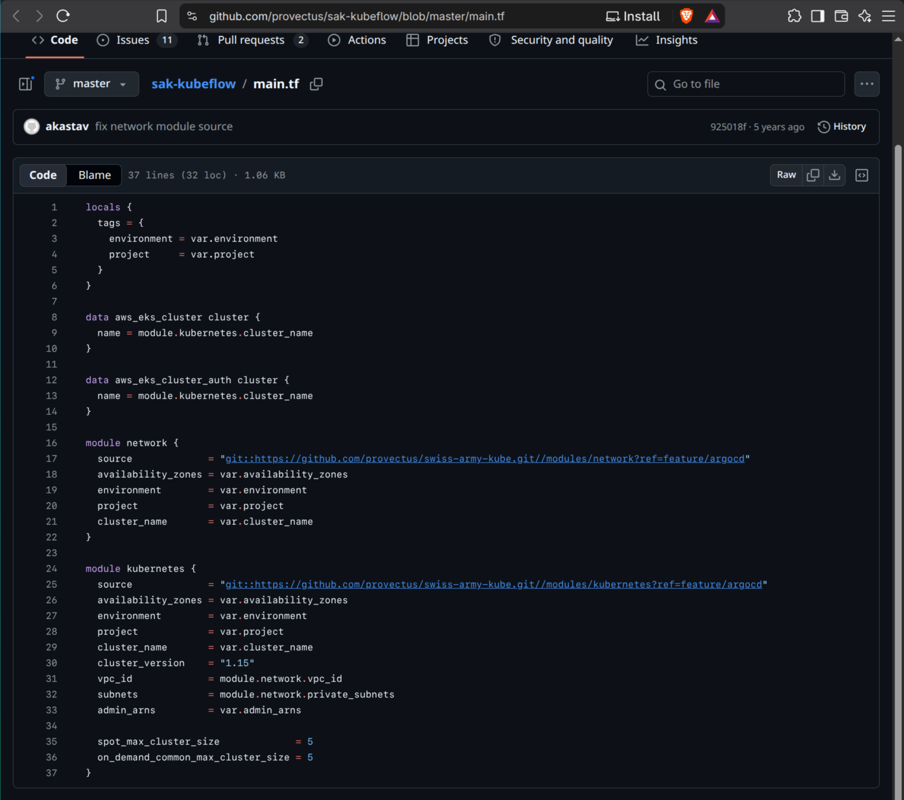
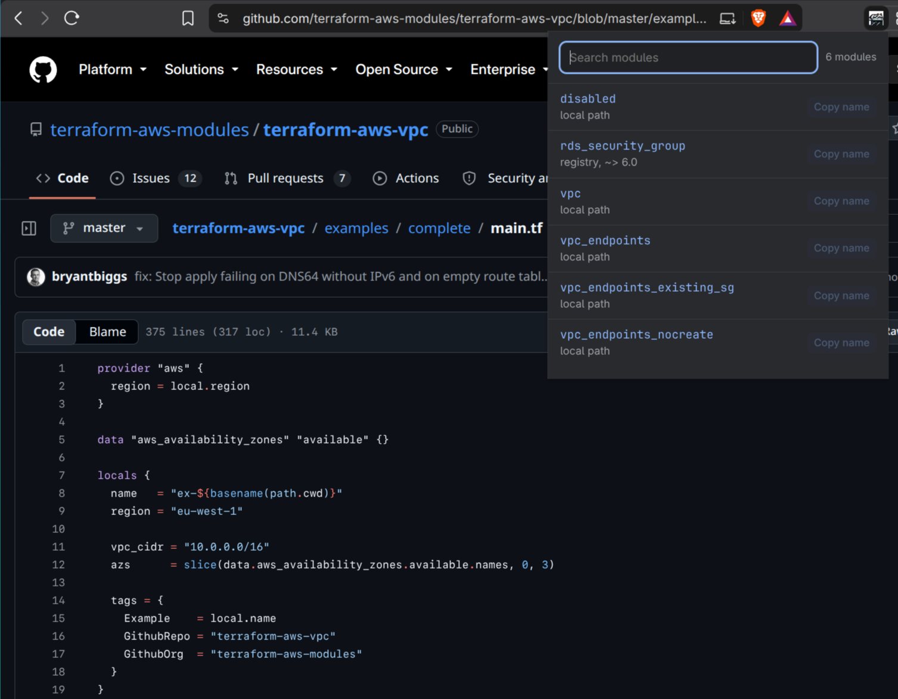

#  IaC Module Linker


## Installing the Extension

A new Chrome Web Store listing is pending. Until it is live, build from source with the [Developing Locally](#developing-locally) steps.

> IaC Module Linker is an independent open-source project. It is not affiliated with, endorsed by, or sponsored by GitHub, Microsoft, GitLab, HashiCorp, or IBM. Terraform is a trademark of HashiCorp; GitHub is a trademark of Microsoft; GitLab is a trademark of GitLab Inc. Both are referenced here only to describe what this extension works with.

## Using the extension

### on page load

When the page loads the extension parses the module sources in your file and turns them into clickable links. It supports `.tf`, `.tofu`, `.hcl`, `.tf.json` and `.tofu.json` files, and both the Terraform and OpenTofu registries. You must grant the extensions permission to have access to [github](https://github.com). See the [Devloping Locally Section](#developing-locally)



### on gitlab

The extension works on [gitlab](https://gitlab.com) file pages too, once you allow it. Open a file on gitlab.com, click the extension, and click `Allow on gitlab.com`. Chrome asks you to confirm, and links show up on gitlab.com pages from then on. GitLab only renders a long file a piece at a time as you scroll, so sources further down are linked as they come into view.

Access to gitlab.com is optional. The extension does not run there until you allow it, and you can take it back from the Site access setting on the `chrome://extensions` page.

### viewing all sources

Navigate to a GitHub or GitLab page where there is Terraform code and click on the extension. The pop-up lists every module on the page with its source type, and its version constraint when it has one.
The module name links to where the source points. The search box filters the list, and `Copy name` copies a module's name.
When a registry module's constraint lags behind the version it resolves to, a second button copies a constraint pinned to that version.
If the page has no modules then `No modules on this page.` is shown.



# How to contribute

I would love for you to contribute to the source code and make the extension even better.

## Contributing

### Submitting a Pull Request

Before you submit your pull request consider the following guidelines:

1. Make sure you have signed commits enabled. You can do that by following GitHubs guide [here](https://docs.github.com/en/authentication/managing-commit-signature-verification/about-commit-signature-verification)
1. Please write a summary of what your change does.
1. Your PR must be reviewed by one of the code owners before you can merge into main.

## Developing Locally

Needs Node and Docker. The HCL parser is a Go wasm module built from `wasm/`.
It is not committed. `make` produces it. See [wasm/README.md](wasm/README.md).

Clone this repository and run.

```
cd iac-module-linker
make build
```

This will generate a dist folder where the javascript is exported to.
Then open up chrome and paste `chrome://extensions/` in the search bar. Once the page has loaded click Load unpacked Extension.
Navigate to the `dist` folder and click okay. To see the extension you must also enable dev mode.
You must also allow the Extension to have access to [github](https://github.com) found in the Site access setting on the `chrome://extensions` page.
Alternatively the extension will flash white in the corner when you navigate to [github](https://github.com) click the Icon to allow the extension to have access to your page.
Note you must do this each time you run `make build` and update the extension.

# Testing

Unit tests run with [jest](https://jestjs.io/docs/getting-started). End to end
tests load the built extension into Chromium with
[Playwright](https://playwright.dev).

### Unit tests

```
make test
```

They run offline. Registry responses are recorded in
`tests/unit/fixtures/registry-responses.json`, so no test reaches the network.
Refresh them with `make record-fixtures`.

### End to end tests

```
make e2e
```

That builds the extension, installs the test dependencies and runs Playwright
against [iac-module-linker-fixtures](https://github.com/NickSpaghetti/iac-module-linker-fixtures),
a repository of Terraform files covering every module source form. It is
mirrored to [gitlab](https://gitlab.com/NickSpaghetti/iac-module-linker-fixtures)
for the GitLab tests. Chrome's permission prompt cannot be clicked from a test,
so those tests load a copy of the build with gitlab.com already allowed.

These load a real browser and visit real GitHub and GitLab pages, so they are slower and
subject to rate limiting. They run on a schedule and before a release rather
than on every pull request.

Extensions cannot be loaded by a headless browser, so the run is headed. On a
machine with no display, put `xvfb-run -a` in front of it.

# Credit

1. This icon was created with the assistance of DALL·E 2.
